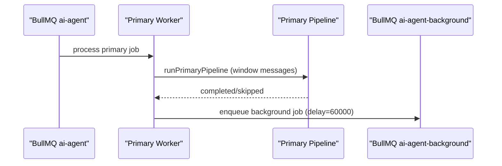
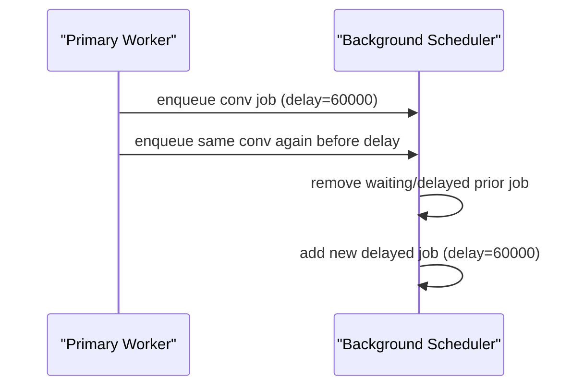
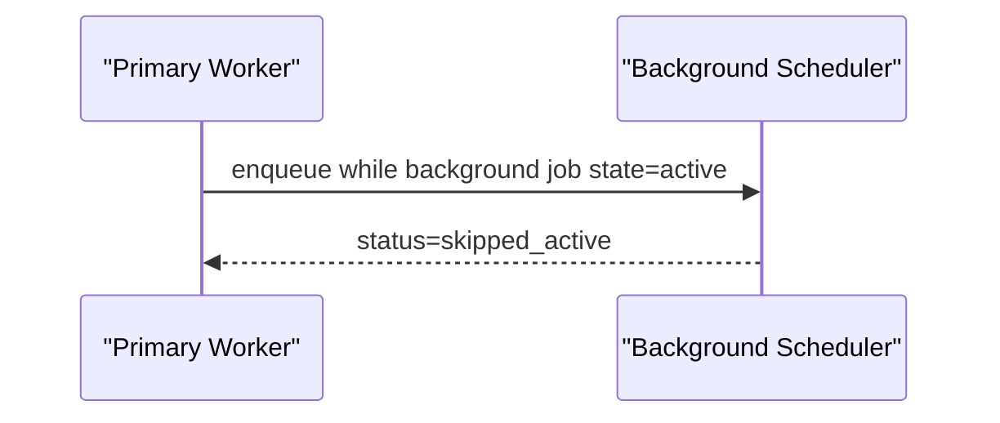

# AI Pipeline Workflow Spec (Primary + Background Split)

Status: Implemented queue/scheduling shell  
Last updated: 2026-03-04  
Scope: Document the decoupled primary and background AI pipeline orchestration.

## 1) Responsibilities Split

### `primary-pipeline`

Real-time conversation handling for the active exchange:

- answer/help/guide the user,
- run immediate turn actions/tool calls,
- advance AI conversation processing cursor.

### `background-pipeline`

Delayed, non-public follow-up pipeline:

- scheduled after primary completion,
- debounced per conversation with a 60s delay,
- currently implemented as a shell/no-op pipeline (triage logic intentionally deferred).

## 2) Runtime Entry Points

| Module | Responsibility |
|---|---|
| `apps/api/src/ai-pipeline/index.ts` | Exports `runPrimaryPipeline`, `runBackgroundPipeline`, and compatibility alias `runAiAgentPipeline -> runPrimaryPipeline`. |
| `apps/api/src/ai-pipeline/primary-pipeline/index.ts` | Primary pipeline entrypoint (current bootstrap no-op result contract). |
| `apps/api/src/ai-pipeline/background-pipeline/index.ts` | Background pipeline shell entrypoint. |
| `packages/jobs/src/ai-agent-job-scheduler.ts` | Primary queue enqueue semantics (`ai-agent`). |
| `packages/jobs/src/ai-agent-background-job-scheduler.ts` | Background queue enqueue/reschedule semantics (`ai-agent-background`). |
| `packages/jobs/src/triggers/ai-agent.ts` | Producer helper for primary queue. |
| `packages/jobs/src/triggers/ai-agent-background.ts` | Producer helper for background queue. |
| `apps/workers/src/queues/ai-agent/worker.ts` | Primary worker + completion/failure hooks + background scheduling trigger. |
| `apps/workers/src/queues/ai-agent-background/worker.ts` | Background queue worker that runs background pipeline shell. |

## 3) Queue & State Model

### 3.1 Primary Queue (`ai-agent`)

- Queue name: `ai-agent`
- Job ID: `ai-agent-${conversationId}`
- Data: `AiAgentJobData`
  - `conversationId`
  - `websiteId`
  - `organizationId`
  - `aiAgentId`
  - `runAttempt?: number`

### 3.2 Background Queue (`ai-agent-background`)

- Queue name: `ai-agent-background`
- Job ID: `ai-agent-background-${conversationId}`
- Data: `AiAgentBackgroundJobData`
  - `conversationId`
  - `websiteId`
  - `organizationId`
  - `aiAgentId`
- Delay: `60_000ms`

### 3.3 Redis Run Cursor (Primary)

- Key: `ai-agent:run-cursor:${conversationId}`
- Value:
  - `messageId`
  - `messageCreatedAt`
- TTL: 24h

### 3.4 DB Cursor (Primary)

Conversation fields:

- `aiAgentLastProcessedMessageCreatedAt`
- `aiAgentLastProcessedMessageId`

Updated after each successfully handled primary message (`completed` or `skipped`).

## 4) Background Queue Contract (Implemented)

`enqueueConversationScopedAiBackgroundJob` behavior:

1. No existing job:
   - create delayed job (`status: "created"`).
2. Existing `delayed` or `waiting` job:
   - remove existing,
   - add fresh delayed job (60s),
   - return `status: "rescheduled"`.
3. Existing `active` job:
   - do not interrupt,
   - return `status: "skipped_active"`.
4. Existing `completed` or `failed` job:
   - remove existing,
   - create delayed job,
   - return `status: "created"`.
5. Existing unexpected state:
   - return `status: "skipped_unexpected"`.

## 5) When Background Is Scheduled

Background scheduling is triggered from primary worker completion hook:

1. Primary run completes (not failed).
2. Primary processed at least one message (`processedMessageCount > 0`).
3. Worker schedules `ai-agent-background` with `delayMs = 60_000`.

Notes:

- Scheduling source is primary completion only.
- Primary failures do not schedule background jobs.
- If a delayed/waiting background job already exists, it is canceled and reposted (debounce reset).
- If background is currently active, scheduling is skipped.

## 6) End-to-End Flow

1. Primary job runs FIFO message window from run cursor.
2. Primary pipeline returns `completed|skipped|error` per message.
3. Primary worker advances DB cursor for handled messages.
4. Primary completion hook maintains primary cursor semantics (immediate follow-up if needed).
5. Primary completion hook schedules background queue (60s) when processed message count > 0.
6. Background worker executes background pipeline shell on delayed trigger.

## 7) Sequence Diagrams

### 7.1 Primary completion -> schedule background

### 7.2 Repeated primary completions within 60s

### 7.3 Background active + new primary completion

## 8) Safety Invariants

1. At most one active/waiting/delayed primary job per conversation (primary job ID dedupe).
2. At most one pending delayed/waiting background job per conversation (background job ID dedupe + reschedule).
3. Background scheduling does not mutate primary run cursor semantics.
4. Background pipeline does not emit public visitor replies in current shell implementation.

## 9) Failure Semantics

- Primary queue failure semantics remain unchanged:
  - failed message cursor pinning,
  - bounded retry attempts with delay,
  - terminal cursor clear.
- Background queue retry semantics are isolated from primary orchestration.
- Primary completion is the only source that mutates background schedule in this version.

## 10) Background v1 Execution Scope

Current implementation:

- background worker and queue are fully wired,
- background pipeline executes as shell/no-op (logs + metrics),
- triage/metadata actions are intentionally not implemented yet.

Planned next iteration:

- title/priority/sentiment/category maintenance logic under background pipeline.

## 11) Migration Map (Concrete File Changes)

### API pipeline structure

- `apps/api/src/ai-pipeline/index.ts`
- `apps/api/src/ai-pipeline/primary-pipeline/index.ts`
- `apps/api/src/ai-pipeline/background-pipeline/index.ts`

### Jobs package

- `packages/jobs/src/types.ts`
- `packages/jobs/src/ai-agent-background-job-scheduler.ts`
- `packages/jobs/src/triggers/ai-agent-background.ts`
- `packages/jobs/src/index.ts`
- `packages/jobs/src/triggers/index.ts`

### Workers

- `apps/workers/src/queues/ai-agent/worker.ts`
- `apps/workers/src/queues/ai-agent/pipeline-runner.ts`
- `apps/workers/src/queues/ai-agent-background/worker.ts`
- `apps/workers/src/queues/index.ts`
- `apps/workers/src/index.ts`

### API queue producers

- `apps/api/src/utils/queue-triggers.ts`

## 12) Validation Commands

1. `bunx tsc -p packages/jobs/tsconfig.json --noEmit`
2. `bunx tsc -p apps/api/tsconfig.json --noEmit`
3. `bunx tsc -p apps/workers/tsconfig.json --noEmit`
4. `bun test packages/jobs/src/ai-agent-background-job-scheduler.test.ts`
5. `bun test packages/jobs/src/triggers/ai-agent-background.test.ts`
6. `bun test apps/workers/src/queues/ai-agent/pipeline-runner.test.ts`
7. `bun test apps/workers/src/queues/ai-agent/worker.test.ts`
8. `bun test apps/workers/src/queues/ai-agent-background/worker.test.ts`
9. `bun test apps/workers/src/queues/index.test.ts`
